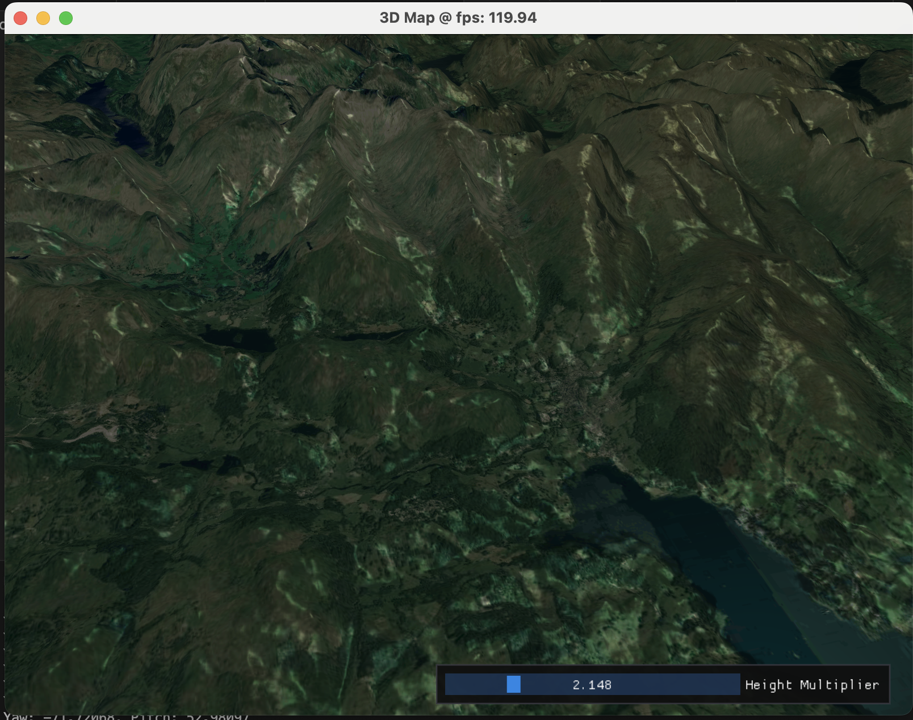

# 3dmaps
Cross platform 3D terrain renderer from real world data.


# Table of contents
 - [Dependencies](#dependencies)
 - [Setup](#setup)
 - [Todos](#todos)

# Dependencies
- GDAL
- GLFW3
- OpenGL 4.0
- Expat

# Setup
Get topography data from: https://opentopography.org/ (topography for the Lake District is included in res/geo.tiff).
<br>
Create a "secret.json" file in the src/ directory with your google static maps API key, e.g.
```javascript
{
    "api_key": "YOUR_API_KEY"
}
```

To build app and texture fetcher run:
``` bash
zig build
```
When building use -Dbackend=[enum] (glfw_opengl3, glfw_wgpu) and -Doptimize=[enum] (Debug, ReleaseSafe, ReleaseFast, ReleaseSmall) to control options.
<br>

Then run this to fetch the textures with the desired zoom level and bounds (zoom = 12 works well).
``` bash
./zig-out/bin/get_textures --output-dir output/ --zoom 12 --bounds 54.5,-3.1,54.7,-2.9
```

Finaly run the app with:
```bash
zig build -Doptimize=ReleaseSafe run
```
### Todos
 - GPX plotting
 - Overlay OSM data

License
----

MIT
